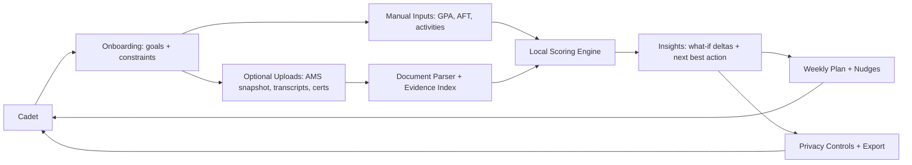
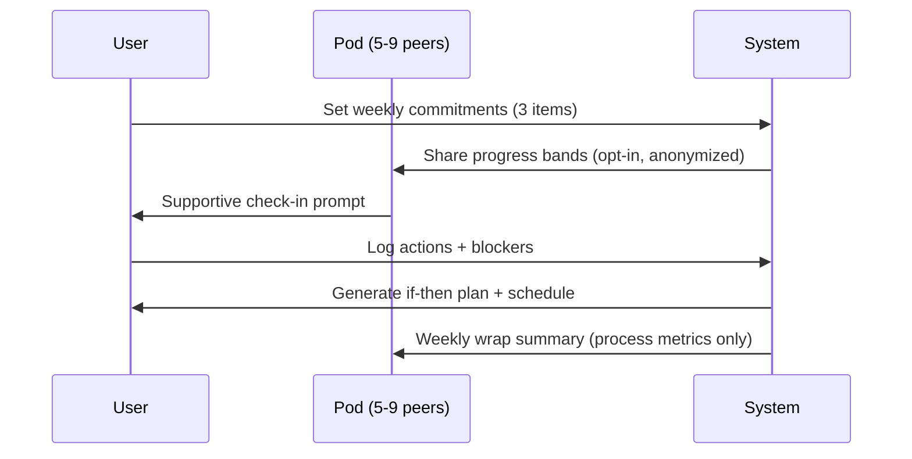

# Designing a Cadet-Focused “Work Smart” App to Improve Army ROTC OMS/OML Outcomes

## Executive summary

An effective cadet-focused app is less a “motivation tool” and more a **decision-support + behavior-change system** built around the reality that Army ROTC advancement and branching are governed by **measured, scored inputs** (OMS/OML and CST evaluation artifacts) and by **process-driven human judgments** (notably Talent Based Branching and leadership assessments). citeturn1view0turn2view0turn28view1turn30view2

Key policy ground truths from the most current publicly available Cadet Command accessions guidance:

- The ROTC **Order of Merit Score (OMS)** is a **100-point model** used to create the national OML standing and identify the **top 20%** as Distinguished Military Graduates (DMG). citeturn1view0turn2view0turn25view0  
- For FY2026–FY2029 cohorts, **Academic Outcomes max 29**, **Leadership Outcomes max 62**, and **Physical Outcomes max 9** OMS points; the **Accessions GPA alone is worth 22/100 OMS points**, making it the highest single “knob.” citeturn2view0turn31view3  
- The official worksheet (AMS) displays subcategory values, standardized scores, and weights; the OMS is calculated in CCIMM year-round, but **OMS values are not comparable year-to-year**, and the national OML itself is generally **not releasable** beyond limited public affairs exceptions. citeturn3view0turn25view0  
- Branching is now tightly coupled to **Talent Based Branching (TBB)**: OMS/OML establishes ordering and “bins,” while branches evaluate talent files and assign ratings; TBB uses multiple inputs (preferences, branch ratings, performance records), so any “Branch Predictor” must be probabilistic, conservative, and explicit about uncertainty. citeturn1view0turn3view0turn30view2turn30view3  

Design implication: the app should prioritize (1) **math transparency** and “what-if” modeling, (2) **evidence workflows** for “hidden points” that routinely get missed (language, study abroad, training/extracurriculars, athletics, employment/SMP rules), (3) **CST evaluation rehearsal** mapped to the Army Leadership Requirements Model (ALRM) and the current Advanced Camp evaluation artifacts, and (4) **behavior-change mechanics** that improve follow-through without manipulation or policy violations (privacy/OPSEC). citeturn2view0turn6view2turn28view1turn32search1turn9search0

Assumptions (explicit): no constraints on platform (iOS/Android/web), budget, or staffing; no guaranteed integration with Cadet Command systems (CCIMM/TBB), so core features must work with **manual entry + document upload**, with optional future integration if authorized. citeturn3view0  

## OMS/OML structure and authoritative weighting

### What “counts” in today’s OMS model

Per the FY2026 ROTC accessions circular, OMS is computed across three categories and used to establish the national OML standing for component selection and branching processes. citeturn1view0turn2view0

For FY2026–FY2029 cohorts:

- **Academic Outcomes: max 29/100**  
  - **Accessions GPA: max 22**  
  - Academic Discipline Mix (ADM): max 2  
  - Language/Cultural Awareness: max 5 citeturn2view0turn31view3turn6view0  

- **Leadership Outcomes: max 62/100**  
  Includes PMS Experience Based Observations derived from the MSIII Campus/Cadet Evaluation Report (CER), training/extracurricular points, maturity/responsibility, employment/SMP, and **Cadet Summer Training (CST): max 25**, plus **RECONDO: 2**. citeturn2view0turn7view2  

- **Physical Outcomes: max 9/100**  
  - On-campus MSIII fall “for record” Army Fitness Test (AFT): max 2  
  - On-campus MSIII spring “for record” AFT: max 4  
  - Athletics participation (varsity/intramural/community): max 3 citeturn5view0turn7view3

Two non-obvious but app-defining realities:

1) **The AMS/CCIMM calculation is the source of truth**, and the underlying model uses standardized scores and weights shown in the AMS report view—meaning cadets can “see the math outputs,” but not always the full statistical machinery behind them. citeturn25view0  
2) **You cannot safely compare raw OMS across years**, a critical warning for any feature that tries to use historical “cut lines.” citeturn3view0  

### How an app should represent this structure

A cadet-facing app should model OMS in two layers:

- **Policy layer (authoritative):** weights, eligible inputs, deadlines, evidence requirements (from Cadet Command circulars and CST policy memos). citeturn2view0turn28view1  
- **User layer (personalized):** the cadet’s current AMS subcategory values and points (entered manually or imported from a signed AMS snapshot), enabling accurate what-if analysis without guessing hidden formulas. citeturn3view0turn25view0  

This “policy + personalized scorecard” architecture prevents the most common failure mode in cadet apps: **giving false precision** about rank/branching.

## Quantitative decision-support features that prevent effort misallocation

### GPA sensitivity modeling and heat maps

#### Why GPA is the highest-leverage knob

The Accessions GPA contributes up to **22/100 OMS points**—larger than the entire physical bucket (9 points) and comparable to major leadership subcomponents. citeturn2view0turn31view3turn5view0

The accessions GPA is explicitly defined as a **combination of Academic GPA and ROTC GPA**, with detailed rules for cumulative year calculations and cross-scale conversions (e.g., quarter-to-semester conversions; converting 3.0/5.0 scales to 4.0). citeturn31view0  

There are also hard constraints: e.g., “GPAs below 2.0 will not be boarded” and GPAs are “not rounded.” citeturn31view0  

#### App feature: “GPA What‑If + Sensitivity”

Because the OMS algorithm uses standardized scores (and likely cohort-relative distributions), the app should provide two modes:

- **Exact mode (best):** cadet enters current OMS breakdown as shown on the AMS (including standardized scores if visible) and the app runs **local what‑if** deltas while holding other inputs constant. This anchors output to the cadet’s real CCIMM state. citeturn25view0  
- **Planning mode (transparent approximation):** when the cadet doesn’t have AMS breakdown, present a clearly-labeled “planning estimate” based on linear scaling. The app must label this as **illustrative**, not predictive, because the official design cautions against across-year and implied predictive comparisons. citeturn3view0turn25view0  

#### Example calculation (planning mode, explicitly illustrative)

Since Accessions GPA is worth up to 22 OMS points, a simple planning estimate is:

- **Estimated GPA points ≈ 22 × (GPA / 4.0)** (illustrative only)

If GPA rises from 3.20 to 3.30, delta ≈ 22 × (0.10 / 4.0) = **0.55 OMS points**.

For comparison, physical outcomes from on-campus AFTs total 6 OMS points max (2 + 4). citeturn5view0turn2view0  
If (illustratively) 6 points scaled linearly across a 600-point fitness test, then +10 AFT points would be ≈ 6 × (10/600) = **0.10 OMS points**—suggesting GPA time may often dominate “points per hour,” especially if tutoring yields meaningful grade movement.

This is exactly the kind of tradeoff visualization that stops cadets from doing “more work” that produces little relative impact.

#### Heat map UI recommendation

Use a single-screen heat map with:

- X-axis: **projected semester GPA** (or cumulative)  
- Y-axis: **course credit weight / grade scenarios**  
- Cells: **Δ OMS (range)** + “confidence label” (Exact vs Planning)  
- A “next best action” callout: “Most efficient lever this term: raise ROTC GPA vs academic GPA,” consistent with the formal “Accessions GPA includes ROTC grades” guidance. citeturn31view0  

image_group{"layout":"carousel","aspect_ratio":"16:9","query":["heat map dashboard UI for grade impact","GPA calculator app heatmap visualization","student progress analytics heatmap UI"]}

### Hidden-points audit: OMS vs scholarship CBEF and evidence workflows

#### CBEF is real—but it is not the OMS model

Cadets often conflate scholarship selection scoring with accession OMS. The scholarship process guide explicitly shows the **Cadet Background and Experience Form (CBEF) = 250 points** within a 1,400-point Whole Person Score used to create a scholarship OML. citeturn37view0  

However, FY2026 OMS documentation does not list CBEF as an OMS component; instead, “background-like” value comes through **training/extracurricular points, athletics, employment/SMP, maturity/responsibility, language/cultural awareness**, and CST performance. citeturn2view0turn7view2turn6view2

**App design consequence:** build an “Audit” feature around the **OMS evidence model**, while optionally supporting a separate “Scholarship Applicant Mode” for CBEF-era users.

#### What counts as “hidden points” in OMS—and what proof is required

High-yield areas with explicit documentation requirements include:

- **Language/Cultural Awareness (max 5 OMS points)**: the model explicitly awards points for language majors/courses, Rosetta Stone training, DLI HeadStart, DLPT/OPI, and study abroad—while requiring **physical evidence** (transcripts, certificates). It also specifies DLPT points procedures requiring **DA Form 330 signed by an authorized Test Control Officer**, and notes some points (e.g., CULP) are suspended. citeturn6view0turn6view1turn6view2  
- **Training + Extracurricular Activities (max 5 OMS points)**: cadets can earn points for defined extracurricular roles (e.g., community service, Ranger Challenge, ROTC recruiter, student government, resident advisor). Critically: **285 total available points**, but **earning 100 points grants the full 5 OMS points** and **no additional OMS points accrue beyond 100**—a classic “cap” where cadets waste effort if they don’t understand the threshold. citeturn6view3turn2view0  
- **Maturity & Responsibility (max 5 OMS points)**: includes clear definitions for full-time/part-time job hours and special rules (e.g., Green-to-Gold ADO restrictions and documentation requirements for approved outside employment). citeturn7view3turn6view3  
- **Athletics (max 3 OMS points)**: varsity/intramural/community participation with criteria and point structures. citeturn7view3turn25view0  

#### App feature: “Evidence-first Audit Checklist”

A robust audit module should behave like a tax-prep workflow:

- For each potential point source, the app asks two questions:  
  1) “Do you have this?” (yes/no/not sure)  
  2) “Can you prove it?” (upload transcript/certificate/memo; or capture “where it lives”) citeturn6view1turn32search1  
- The output is a **“Missing Points Packet”**: a downloadable checklist plus a timeline aligned to accessions deadlines (local program deadlines matter, but the app can at least remind users that AMS verification/signing and data validation are critical). citeturn1view0turn3view0  

This is also a behavior-change win: it turns “I should do more extracurriculars” into “I need one role that crosses the 100-point cap, and I must document it.”

### AFT/ACFT event-specific ROI modeling

#### Policy and scoring ground truths

The FY2026 accessions circular uses “AFT” terminology (Army Fitness Test) and assigns up to **2 OMS points (fall)** and **4 OMS points (spring)**, with “no alibis” for missed record tests. citeturn5view0turn7view3  

The Army’s AFT program page and official scoring tables show the AFT/ACFT scoring apparatus is actively maintained and updated (e.g., updated scoring tables effective June 2025). citeturn36search1turn36search0  

#### App feature: “Event ROI Planner”

The event ROI concept should be implemented with **stepwise thresholds**, not “linear improvement,” because fitness scoring tables create “cliffs” where small performance changes yield discrete point jumps. citeturn36search0  

A practical model:

1) User inputs their current event performances (deadlift weight, SDC time, etc.).  
2) App computes current AFT score using the official scoring tables. citeturn36search0  
3) App computes **marginal points** for realistic improvements (e.g., +5 lbs deadlift; −5 sec SDC).  
4) App recommends the “closest next scoring threshold” per event and schedules workouts proportional to the cadet’s available time.  
5) App maps AFT total-score deltas into a **range** of OMS deltas, because the OMS conversion is displayed in AMS but not fully specified in the circular text; the app should therefore (a) let users enter their current “AFT contribution” from AMS if known, or (b) use conservative linear mapping in planning mode. citeturn25view0turn3view0  

#### Leaderboards with safeguards

Leaderboards can increase effort through social comparison, but in high-stakes contexts they can also produce unhealthy competition, shame, and data leakage. A cadet app should use:

- **Opt-in micro-cohorts** (5–9 people) instead of unit-wide default leaderboards.  
- **Tiered comparison** (e.g., “you vs your last 30 days,” “you vs cohort median”) rather than rank-ordering by default.  
- **Privacy-preserving displays** (nicknames, rounded scores, or “bands” like Bronze/Silver/Gold) to reduce sensitive disclosure risk, especially since OML itself is generally not releasable and is handled carefully. citeturn25view0  

## CST performance simulator mapped to ALRM, Blue Cards, and Form 1059 artifacts

### What CST actually evaluates and how data flows to records

CST policy on evaluations states cadets are observed and evaluated in **three critical areas: Physical Fitness, Military Skills Competency, and Leadership**, with evaluators observing and counseling cadets based on **FM 6-22 competencies and attributes**. citeturn28view1turn23view0  

Leadership evaluations are conducted using the SOAR (“Blue Card”) process, with a minimum number of leader evaluations and explicit scoring bands (Excellent/Proficient/Capable/Unsatisfactory) multiplied by weight. citeturn28view1  

CST also produces a formal “Advanced Camp Evaluation Report (ACER)” (labeled on USACC Form 1059), which explicitly references ALRM attributes/competencies (Character, Presence, Intellect, Leads, Develops, Achieves) and includes multiple outcome sections. citeturn28view0turn28view1  

### App feature: “Leadership Rubrics + Blue Card Rehearsal”

This module should be structured as deliberate practice, not “scripted answers.”

Core elements:

- A **rubric library** aligned to the six ALRM buckets (Character, Presence, Intellect, Leads, Develops, Achieves), derived from doctrinal definitions and leader development guidance. citeturn21view0turn23view0  
- A **Blue Card rehearsal loop**: brief scenario → user chooses specific behaviors → app scores against rubric → user generates a “next-time if‑then plan.”  
  - “If I receive ambiguous guidance, then I will restate task/purpose/constraints and confirm timeline.” (This leverages implementation intentions, a meta-analytic evidence base for improving follow-through.) citeturn34search16turn34search12  
- A **feedback ingestion flow**: after field problems or labs, cadet logs (a) what happened, (b) what went well, (c) one behavior to adjust—mirroring doctrine emphasis on observation, specific feedback, and avoiding vague generalities. citeturn23view0  

### App feature: “CST ACER Preview”

Because the ACER/1059 artifact structure is known, the app can:

- Let cadets self-rate each ALRM category with concrete behavioral anchors. citeturn28view0turn21view0  
- Generate a “camp-ready” development plan to bring to counseling sessions (the policy memo stresses counseling and developmental plans). citeturn28view1  
- Provide a **post-camp continuation plan** that maps “needs improvement” areas to on-campus training actions (the policy memo explicitly frames counseling as feeding a continued development plan). citeturn28view1turn23view0  

## Branch-probability forecasting under TBB with realistic caveats

### Why “Branch Predictor” is both high-value and high-risk

The FY2026 accessions circular clarifies that the national OML is used to position active-duty eligible cadets within branch “bins” once branches rate the cadet record during TBB, and that the process considers **Cadet preference**, **branch proponent assessment ratings**, **Cadet performance record**, and ADSO/detail preferences, among other factors. citeturn1view0turn3view0  

Army public affairs coverage of FY26 TBB reinforces that TBB uses multiple inputs (assessments, interviews, academic performance, leadership evaluations) and reports high match rates to top preferences at an aggregate level—but this does not translate into individual guarantees. citeturn30view2turn30view3  

### Design requirements for a responsible Branch Predictor

A cadet-facing “Branch Predictor” should be framed as **decision support** with explicit uncertainty bands and guardrails, reflecting the official caution that OMS is not comparable across years and that past-year results should not be used to speculate. citeturn3view0turn25view0  

Recommended predictor tiers:

- **Tier one: controllable readiness signals**  
  - “Have you completed branch interviews? Do you have branch ratings (MP/P/LP)?” citeturn30view3  
  - “Is your OMS data verified and signed on AMS?” citeturn1view0turn3view0  

- **Tier two: competitive position (within-year)**  
  - Use **percentile within cohort** rather than raw OMS for any historical comparisons, because of non-comparability. citeturn3view0  

- **Tier three: historical calibration (optional, clearly labeled)**  
  - Only if you have reliable data (official releases, FOIA’d aggregates, or validated cohort-sourced data), model probabilities using broad bands (e.g., 50–70%); never display “You have a 92.4% chance.”  

### UI/UX recommendations for Branch Predictor

A strong Branch Predictor UI should include:

- “My Inputs” panel: branch preference list, interview status, branch ratings, ADSO/detail preferences (as applicable), and OMS percentile band. citeturn3view0turn30view3  
- “Outcome Bands” panel: per-branch likelihood shown as **Low / Medium / High** with a “why” explainer referencing controllable levers (interview completion, strengthening talent file, improving leadership evaluations). citeturn30view3turn23view0  
- “Next Best Action” panel: one action for this week (e.g., “Schedule interview,” “Update resume line items,” “Get a faculty letter,” “Fix missing language evidence”). citeturn30view3turn6view1  
- A “Policy Reality Check” banner: “No predictor can guarantee branching; results depend on Army requirements and TBB outcomes.” citeturn3view0turn30view2  

## Social and psychological methods that reliably drive self-improvement

### Evidence-based behavior frameworks mapped to app mechanics

A high-performing cadet app should treat behavior change as an engineering problem: **reduce friction, create prompts, and build accountability**—without coercion.

The following mapping uses established frameworks:

- **BCT Taxonomy (v1)** standardizes behavior change techniques and helps avoid “vibes-based” feature design. citeturn34search9turn34search1  
- **COM-B / Behavior Change Wheel** explains behavior as Capability, Opportunity, and Motivation, guiding intervention design. citeturn35search6turn35search3turn35search9  
- **Self-Determination Theory (SDT)** emphasizes autonomy, competence, and relatedness; recent educational meta-analyses link need-support to better outcomes, supporting designs that feel self-directed rather than controlling. citeturn35search5turn35search2  
- **Fogg Behavior Model** highlights Motivation, Ability, and Prompt; it is particularly useful for “micro-actions” and timing nudges. citeturn34search3turn34search15  
- **Supportive Accountability** explains why human support (or credible peer accountability) increases adherence in digital interventions. citeturn35search1turn35search7  
- **Implementation intentions (“if‑then plans”)** have meta-analytic support for bridging intention-to-action gaps. citeturn34search16turn34search12  

### Concrete feature design patterns (with safeguards)

A cadet app should rely on “high-signal” mechanics:

- **Goal decomposition + action planning**  
  - Weekly “one academic lever + one fitness lever + one leadership lever,” each with a measurable action and an if‑then plan. citeturn34search16turn34search3  

- **Supportive accountability micro-cohorts**  
  - 5–9 cadets opt-in; weekly check-in with a structured script (“what I did / what blocked me / what I’ll do next”) and a credibility role (peer mentor, MSIV, or vetted coach). citeturn35search1  

- **Leaderboards used as “progress boards,” not status boards**  
  - Highlight streaks of process behaviors (study sessions logged, workouts completed, leadership reflections done), not raw OMS rank. This supports competence while reducing controlling pressure. citeturn35search5turn25view0  

- **Friction reduction as a first-class feature**  
  - “One-tap log,” templates for tutoring scheduling, and “evidence capture” workflows (photo/scan → label → checklist) directly increase ability and opportunity in COM‑B terms. citeturn35search3turn32search1  

### Ethical engagement and dark-pattern avoidance

Because this app targets a high-stakes population, it must explicitly avoid manipulative engagement loops (“dark patterns”) that coerce use or obscure choices.

Dark patterns literature documents how interfaces can steer users into unintended decisions and erode autonomy and trust. citeturn33search1turn33search2  

Practical safeguards:

- No infinite-scroll “doom feeds” inside the app; keep content modules time-boxed. citeturn33search1  
- Opt-in notifications with granular controls (by category: GPA planning, fitness, cohort check-ins). citeturn9search0turn33search2  
- Default to privacy-preserving social settings; never default to unit-wide exposure.

## Social media strategy, acquisition tactics, and policy constraints

### Content pillars that match cadet psychology and “work smart” positioning

Your social media growth strategy should be an extension of the app’s core promise: **clarity + credible progress**.

Recommended pillars:

- **“OML math made simple”** (short videos): explain what’s worth 22 points vs what’s capped, why evidence matters, what “standardized scores” means in practice. citeturn2view0turn25view0turn6view3  
- **“CST performance behaviors”**: scenario breakdowns mapped to Character/Presence/Intellect/Leads/Develops/Achieves, consistent with ALRM and CST evaluation guidance. citeturn21view0turn28view1turn28view0  
- **“Fitness ROI micro-coaching”**: event threshold hacks using official scoring tables (e.g., “here’s where a 5‑lb increase matters”). citeturn36search0turn5view0  
- **“Branching reality checks”**: teach the inputs to TBB (interviews, talent file, ratings) and discourage misinformation/speculation. citeturn30view2turn30view3turn3view0  

Acquisition tactics that align with behavior science:

- Give away an “OMS Audit Checklist” lead magnet (email capture) and a “GPA What‑If” web calculator; then convert into app onboarding.  
- Use micro-cohort challenges as a viral loop: “Join a 7‑day study + workout sprint with your accountability pod.” (This is supportive accountability + relatedness.) citeturn35search1turn35search5  

### DoD/Army social media and OPSEC constraints

If your social media presence is (or could be perceived as) an official DoD/Army presence, you must follow DoD and Army public affairs rules:

- **DoDI 5400.17** governs official use of social media for public affairs purposes (external official presences) and includes guidance on official and personal use considerations. citeturn9search0turn9search4  
- **Army Regulation 360‑1** assigns responsibilities for Army social media guidance and maintaining Army social media guides. citeturn9search1  

Operational security implications must be treated seriously; as a practical design rule: never encourage posting training schedules, locations, or sensitive unit details, and build automated reminders in your content creation workflow to avoid sensitive disclosures. citeturn9search10turn9search1  

### FERPA and student-data privacy constraints

If the app stores academic grades, transcripts, or tutoring records for students at institutions receiving U.S. Department of Education funds, FERPA concepts become relevant:

- “Education records” include records directly related to a student maintained by the institution or a party acting on its behalf. citeturn32search0  
- The Department’s vendor guidance highlights how third-party service providers may receive student data under the “school official” exception when appropriate conditions and contracts exist. citeturn32search1turn32search2  

Even if you are not contracting directly with universities, your safest architectural posture is: **data minimization**, user-controlled exports, clear consent, and separation between public social features and private academic artifacts.

## Practical build blueprint

### Feature ROI vs data needs vs implementation complexity

| Feature | Expected outcome leverage | Primary data inputs | Evidence / policy basis | Complexity | Key risks |
|---|---:|---|---|---:|---|
| OMS “What‑If” Simulator (GPA + buckets) | Very high (prevents misallocated effort) | AMS/CCIMM values (manual entry), GPA rules | OMS weights + GPA construction rules citeturn2view0turn31view0turn25view0 | Medium | False precision if not anchored to AMS |
| GPA Heat Map + Sensitivity | High | GPA history + planned grades | Accessions GPA worth 22/100 citeturn31view3 | Medium | Overpromising rank changes |
| Hidden Points Audit + Evidence Packets | High | Documents (transcripts/certs), activity logs | Language and extracurricular rules + evidence requirements citeturn6view1turn6view2turn6view3 | Medium | Privacy handling of uploads |
| AFT ROI Planner | Medium–high | Event performances; scoring tables | Official scoring tables + OMS AFT weights citeturn36search0turn5view0 | Medium | Injuries if training advice is unsafe (use disclaimers) |
| CST Blue Card + ACER Simulator | High | Scenario practice + reflections | CST evaluation policy + ALRM + FM 6‑22 citeturn28view1turn28view0turn23view0turn21view0 | High | “Coaching to the test” perception; must emphasize development |
| Branch Predictor (probabilistic) | High motivation; moderate accuracy | OMS percentile, branch ratings, interviews | TBB multi-input reality + non-comparable OMS warning citeturn3view0turn30view2turn1view0 | High | Misinforming users; must show uncertainty bands |
| Micro-cohorts + supportive accountability | Medium–high adherence | Check-ins, goals, streaks | Supportive accountability + SDT autonomy/relatedness citeturn35search1turn35search5 | Medium | Toxic comparison; privacy leaks |

### Sample weekly user flow

| Day | Cadet action | App mechanics | Behavior principle |
|---|---|---|---|
| Monday | Set weekly “smart plan” (1 academic, 1 fitness, 1 leadership) | Auto-suggest based on capped vs uncapped levers; if‑then plan builder | COM‑B + implementation intentions citeturn35search3turn34search16 |
| Tuesday | Study session + grade projection update | “GPA what-if” refresh; reminders limited to user opt-in | Ability + prompt (FBM) citeturn34search3turn34search15 |
| Wednesday | AFT event focus workout | ROI planner chooses next scoring threshold | Threshold-based reinforcement citeturn36search0 |
| Thursday | Leadership lab reflection | Blue Card rehearsal; one corrective action | FM 6‑22 feedback specificity citeturn23view0 |
| Friday | Evidence cleanup | Upload/label 1 document (language/course/cert) | Friction reduction citeturn6view1turn32search1 |
| Sunday | Cohort check-in | 10‑minute supportive accountability script | Supportive accountability citeturn35search1 |

### Mermaid diagram: end-to-end data flow

### Mermaid diagram: micro-cohort accountability loop

## UI/UX recommendations for the two flagship simulators

### What‑If GPA/OMS Simulator

Design principles:

- Default to **“Explain the math”**: show the OMS buckets and maximum points (29/62/9) and clearly label which inputs are “capped.” citeturn2view0turn6view3  
- Provide a “Source of truth” toggle: “Using my AMS values” vs “Planning estimate,” reflecting the AMS/standardized score reality. citeturn25view0turn3view0  
- Show deltas as **ranges** whenever the app is not anchored to AMS.  

Core screen layout (recommended):

- Top: “Your OMS dashboard” (bucket bars + caps)  
- Middle: “What-if controls” (GPA slider, AFT score slider, checkboxes for activities)  
- Bottom: “Best next move this week” + “evidence needed”  

### Branch Predictor

Design principles:

- Big “uncertainty honesty”: explain that TBB uses interviews/ratings + requirements and that OMS is not comparable year to year. citeturn3view0turn30view2turn30view3  
- Avoid “rank porn”: do not display “You will get Infantry.” Display “High/Medium/Low” plus which controllable actions change it.

Recommended modules:

- “Branch Fit” (from user inputs + branch rating outcomes once available) citeturn30view3  
- “Competitive Position” (percentile band only; no raw OMS comparisons across years) citeturn3view0  
- “Action Queue” (interviews, file improvements, leadership practice, evidence audit)

---

**Referenced entities (for orientation):** entity["organization","U.S. Army Cadet Command","rotc headquarters"]; entity["point_of_interest","Fort Knox","Kentucky, US"]; entity["book","USACC Circular 601-26-1","rotc accessions fy2026"]; entity["book","Army Doctrine Publication 6-22","army leadership and the profession"]; entity["book","Field Manual 6-22","developing leaders 2022"]; entity["book","Department of Defense Instruction 5400.17","official use of social media"]; entity["book","Army Regulation 360-1","army public affairs program"]; entity["book","CST Policy Memorandum 20","evaluations and appeals 2025"]; entity["book","USACC Form 1059","advanced camp evaluation report 2025"]; entity["organization","U.S. Department of Education","student privacy office"]